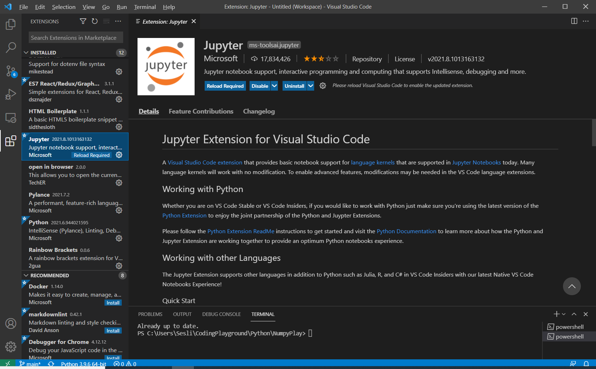

# NumpyExploration
## Read Order
    **Test Notebook
    **FetchOperations
    
On the road to taking the dive from calculus to learning statistics and data science.

1 --installed Anaconda https://www.anaconda.com/products/individual

2 --Open Anaconda Navigator
    

**The Jupyter Notebook opens a window in your browser with your local files at your disposal. You can create a new file here as well. You'd make a python 3 file to make a NumPy notebook**
--Here is my file structure in Jupyter for your viewing pleasure (or displeasure)--

**You can playwith NumPy notebooks in VS Code!**
--I needed Remote - WSL and Jupyter to make it work.

**Jupyter notebooks have file extension .ipynb and they function kinda cool in my opinion. They have individual cells of code chunked and spaced out kind of like a day planner. You can run individual cells of code or run from partway down a code list. Probably more I'm unaware of but I'm excited about it**

